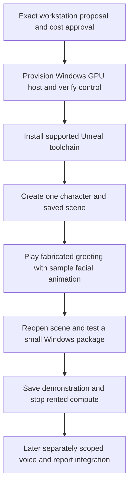

# Remote persistent agent and avatar — build pack

Prepared 2026-09-17; updated 2026-09-20. **Current priority: build an isolated Unreal character first, using a fabricated/sample greeting. The remote Windows GPU workstation proposal awaits concrete cost approval. Presence 0.3 and existing data are preserved; added report access and EA integration are on hold.**

Repository: [remote-persistent-agent-avatar-with-compute-access](https://github.com/6t8hggfm44-tech/remote-persistent-agent-avatar-with-compute-access).

Start with [the Unreal character build](docs/12-unreal-character-first.md). Vagon Blaze is the proposed authoring pilot, pending exact region, storage, total-cost approval and verified desktop control. Shadow Power Pro remains an alternative. No workstation has been purchased or installed, and no character scene has been built. Initial persistence means saving and reopening the character identity and scene; it does not mean 24/7 operation.

## Open the working local prototype

**Presence 0.3** lets you edit a persona, save durable memory notes, select repository documents and reports for AI conversations, and inspect the supplied sources. It also retains preview conversations and persistent sample tasks. It runs locally with Python 3.9+ and no third-party packages. Preview mode is free; real replies use separately authorized API credit.

```sh
python3 -B -m app.server --port 8765
```

Then open [http://127.0.0.1:8765](http://127.0.0.1:8765). On a Mac, `start.command` starts the same service. Keep it running while using the app. [Read the memory and repository conversation guide](docs/11-memory-and-repository-conversations.md).

The app starts in scripted preview mode. The [live text connection guide](docs/10-live-text-connection.md) explains key entry, test allowance, data handling and verified boundaries. Voice, Unreal and EA remain disconnected. Conversations, persona settings, memories, imported documents and usage reservations stay in ignored local `runtime-data/`; credentials stay in server memory only. Private runtime data is excluded from Git and source bundles.

The existing app is preserved while the isolated character is built. Do not add report/repository access, live API calls or generic chat features in this increment. Retain existing report snapshots; reading necessarily copies data into memory, so no zero-copy guarantee is made. A snapshot is not a live connection, and imported agent instructions remain source data. The broader architecture below is a later roadmap, not the current execution order.

## Later integrated outcome

Build two connected projects:

1. **Persistent agent and remote compute:** an always-available backend with durable task state, live governance loading, an approval system, authorized tool adapters, and a controlled connection to a remote graphics workstation.
2. **Avatar interface:** a small browser interface plus a packaged Unreal application containing one MetaHuman, connected through a media bridge. Use the selected provider's verified remote display; add integrated browser streaming only after the packaged renderer works.

**An app is needed for integration. A new native Mac/iPhone app is not needed for the first version.** A browser interface can provide login, push-to-talk, text, task status, and approvals. Unreal supplies the rendered character; the backend supplies persistence and actions. Optional PWA installation can follow browser testing. Native applications become worthwhile only if measured browser limitations require them.

After the isolated character demo, a separately authorized voice integration can use a controlled speech chain: microphone → transcription → backend agent → speech generation → Unreal audio and face → remote display. This makes the spoken answer traceable to the same backend that performs work. Realtime speech is a later improvement with its own event and interruption tests.

## Start reading here

| Reader / purpose | File |
|---|---|
| Current next step: isolated Unreal character | [Unreal character first](docs/12-unreal-character-first.md) |
| Completed memory and repository milestone | [Memory and repository conversations](docs/11-memory-and-repository-conversations.md) |
| Pete: architecture and choices | [System design](docs/01-system-design.md) |
| Build the persistent backend | [Backend workflow](docs/02-backend-workflow.md) |
| Provision and operate remote graphics | [Workstation workflow and costs](docs/03-workstation-workflow.md) |
| Decide and build the avatar app | [Separate avatar project](docs/04-avatar-project.md) |
| Connect components without guessing | [Integration contracts](docs/05-integration-contracts.md) |
| Understand access and human steps | [Permissions and handoff](docs/06-permissions-and-handoff.md) |
| Prove it works and keep it running | [Validation and operations](docs/07-validation-and-operations.md) |
| See evidence and unsettled decisions | [Sources and decisions](docs/08-sources-and-decisions.md) |
| Future AI executor | [Start here](agent/START_HERE.md), then [AGENTS.md](AGENTS.md) |
| Machine-readable entry point | [project.json](project.json), [task graph](agent/tasks.json), [state](agent/state.json) |

## Current build sequence



Keep this demo disconnected from reports, existing Presence context and API keys. Record editor and packaged results separately; sample facial animation does not prove arbitrary live speech lip-sync. Preserve the existing app and local data throughout.

## Later integrated completion criteria

- Close Unreal and disconnect the GPU workstation; the authorized backend still serves text, task status, and approved background jobs.
- Restart the backend; accepted tasks, results, permissions, and audit history recover without duplicate side effects.
- Reopen the avatar; it reconnects to the same agent state and speaks responses whose audio drives its face.
- A tool call follows current governance and applicable standing authorization. A pending approval survives a restart and cannot be replayed against changed action details.
- A user can stop speech, stop a job, revoke workstation access, and see whether the system is offline, waiting, or working.

## Important feasibility findings

Vagon Blaze is the **proposed current pilot**, pending cost approval and an actual benchmark; Shadow Power Pro remains an alternative. Shadow's listed 28 GB RAM is below Epic's current 32 GB MetaHuman authoring recommendation, and its service limits prevent treating it as an unlimited unattended render server. See the current [proposal](docs/12-unreal-character-first.md) and historical [workstation assessment](docs/03-workstation-workflow.md).

Epic's live audio facial-animation tools require an early packaging experiment. An editor demonstration does not establish that the same solver works in a distributable Unreal application. The avatar workflow defines the decision and fallback.

The local prototype above is completed work. The current remote-workstation/character direction is authorized for preparation, with purchase and provisioning still gated on the concrete cost and account steps. No new live API use, EA activation or recurrence is authorized by this milestone.

## Information boundaries

The new repository was public when checked. Keep it suitable for public source and documentation. Private governance, preferences, transcripts, task records, credentials, licensed character assets, and workstation identifiers belong in authorized private storage. The original [reconstruction](sources/EA_Unreal_Remote_Setup_Reconstruction_2026-09-17.md) is historical input, not an instruction to activate or purchase anything. Current instructions and live controlling documents take precedence at execution time.

The local prototype is implemented. The broader architecture remains a proposed design with measurable gates; cloud/GPU/voice compatibility has not yet been demonstrated.
