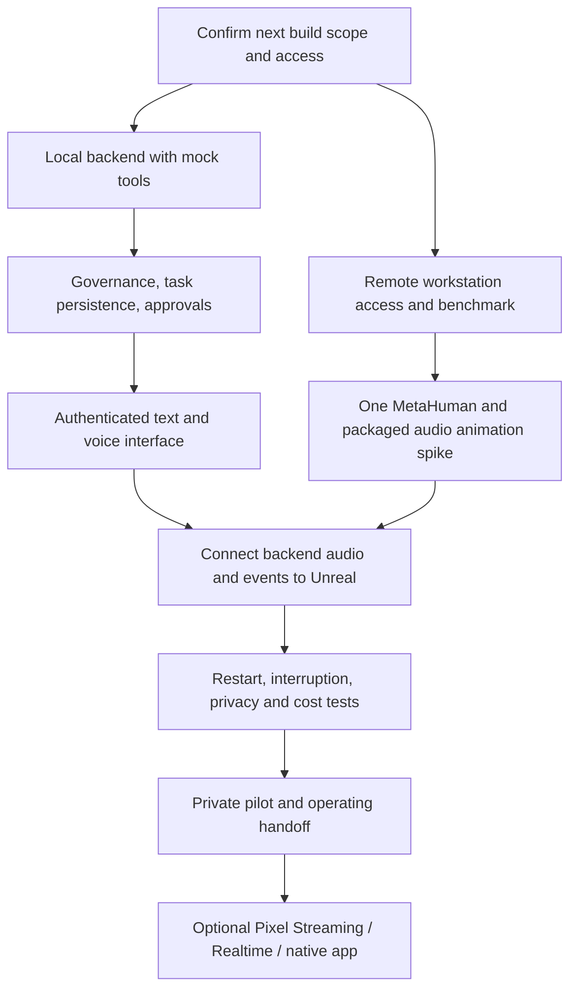

# Remote persistent agent and avatar — build pack

Prepared 2026-09-17; updated 2026-09-18. **Current status: Presence 0.3 adds explicit saved memory, a private document/report library, and bounded access to project documentation. EA integration is on hold.**

Repository: [remote-persistent-agent-avatar-with-compute-access](https://github.com/6t8hggfm44-tech/remote-persistent-agent-avatar-with-compute-access).

## Open the working local prototype

**Presence 0.3** lets you edit a persona, save durable memory notes, select repository documents and reports for AI conversations, and inspect the supplied sources. It also retains preview conversations and persistent sample tasks. It runs locally with Python 3.9+ and no third-party packages. Preview mode is free; real replies use separately authorized API credit.

```sh
python3 -B -m app.server --port 8765
```

Then open [http://127.0.0.1:8765](http://127.0.0.1:8765). On a Mac, `start.command` starts the same service. Keep it running while using the app. [Read the memory and repository conversation guide](docs/11-memory-and-repository-conversations.md).

The app starts in scripted preview mode. The [live text connection guide](docs/10-live-text-connection.md) explains key entry, test allowance, data handling and verified boundaries. Voice, Unreal and EA remain disconnected. Conversations, persona settings, memories, imported documents and usage reservations stay in ignored local `runtime-data/`; credentials stay in server memory only. Private runtime data is excluded from Git and source bundles.

The immediate priority is repository discussion, durable memory and controlled tools before speech. A repository snapshot is not a live connection, and imported agent instructions remain source data. The detailed roadmap below remains the plan for later stages. This local milestone deliberately uses SQLite and a dependency-free server before moving to the proposed production stack.

## Recommended outcome

Build two connected projects:

1. **Persistent agent and remote compute:** an always-available backend with durable task state, live governance loading, an approval system, authorized tool adapters, and a controlled connection to a remote graphics workstation.
2. **Avatar interface:** a small browser interface plus a packaged Unreal application containing one MetaHuman, connected through a media bridge. Start with Shadow's existing remote display; add integrated browser streaming only after the packaged renderer works.

**An app is needed for integration. A new native Mac/iPhone app is not needed for the first version.** A browser interface can provide login, push-to-talk, text, task status, and approvals. Unreal supplies the rendered character; the backend supplies persistence and actions. Optional PWA installation can follow browser testing. Native applications become worthwhile only if measured browser limitations require them.

The first implementation should use a controlled speech chain: microphone → transcription → backend agent → speech generation → Unreal audio and face → remote display. This makes the spoken answer traceable to the same backend that performs work. Realtime speech is a later improvement with its own event and interruption tests.

## Start reading here

| Reader / purpose | File |
|---|---|
| Current memory and repository milestone | [Memory and repository conversations](docs/11-memory-and-repository-conversations.md) |
| Pete: architecture and choices | [System design](docs/01-system-design.md) |
| Build the persistent backend | [Backend workflow](docs/02-backend-workflow.md) |
| Provision and operate remote graphics | [Workstation workflow and costs](docs/03-workstation-workflow.md) |
| Decide and build the avatar app | [Separate avatar project](docs/04-avatar-project.md) |
| Connect components without guessing | [Integration contracts](docs/05-integration-contracts.md) |
| Understand access and human steps | [Permissions and handoff](docs/06-permissions-and-handoff.md) |
| Prove it works and keep it running | [Validation and operations](docs/07-validation-and-operations.md) |
| See evidence and unsettled decisions | [Sources and decisions](docs/08-sources-and-decisions.md) |
| Future AI executor | [Start here](agent/START_HERE.md), then [AGENTS.md](AGENTS.md) |
| Machine-readable entry point | [project.json](project.json), [task graph](agent/tasks.json), [state](agent/state.json) |

## Build sequence



Work on the backend and avatar feasibility can proceed in parallel after authorization. Do not wait for a photorealistic character before proving persistent tasks and approvals. Do not invest in scene polish before proving packaged speech animation.

## What completion means

- Close Unreal and disconnect the GPU workstation; the authorized backend still serves text, task status, and approved background jobs.
- Restart the backend; accepted tasks, results, permissions, and audit history recover without duplicate side effects.
- Reopen the avatar; it reconnects to the same agent state and speaks responses whose audio drives its face.
- A tool call follows current governance and applicable standing authorization. A pending approval survives a restart and cannot be replayed against changed action details.
- A user can stop speech, stop a job, revoke workstation access, and see whether the system is offline, waiting, or working.

## Important feasibility findings

Shadow Power Pro remains a **candidate pilot workstation**. Its listed 28 GB RAM is below Epic's current 32 GB MetaHuman authoring recommendation; actual project performance must be tested. Base service limits also prevent treating it as an unlimited unattended render server. See the sourced [workstation assessment](docs/03-workstation-workflow.md).

Epic's live audio facial-animation tools require an early packaging experiment. An editor demonstration does not establish that the same solver works in a distributable Unreal application. The avatar workflow defines the decision and fallback.

The initial planning request created no runtime. Pete subsequently authorized starting the build while setting EA integration aside; the local prototype above is the completed first milestone. Purchases, cloud deployment, live account connections, EA activation and new recurrence remain outside this milestone.

## Information boundaries

The new repository was public when checked. Keep it suitable for public source and documentation. Private governance, preferences, transcripts, task records, credentials, licensed character assets, and workstation identifiers belong in authorized private storage. The original [reconstruction](sources/EA_Unreal_Remote_Setup_Reconstruction_2026-09-17.md) is historical input, not an instruction to activate or purchase anything. Current instructions and live controlling documents take precedence at execution time.

The local prototype is implemented. The broader architecture remains a proposed design with measurable gates; cloud/GPU/voice compatibility has not yet been demonstrated.
