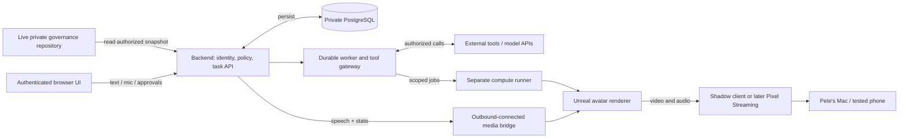

# System design and app decision

## Decision

Use a small persistent backend and an on-demand GPU renderer. Build one browser control interface and one Unreal renderer, connected by an authenticated bridge. Keep backend execution, workstation administration, avatar media, and the user's microphone as distinct capabilities.

These are design recommendations awaiting implementation authorization. They refine the supplied reconstruction without treating its recommendations as settled purchases.

## Components and proposed technologies

| Component | Proposed initial implementation | Responsibility |
|---|---|---|
| Control interface | TypeScript + React browser app, responsive layout | Text, microphone, approvals, progress, stop controls, renderer status |
| Backend API | Python + FastAPI | Authentication, requests, policy and approval enforcement, task API |
| Worker | Separate Python process using a PostgreSQL job table | Durable jobs, leases, retries, cancellation, tool execution |
| Durable store | PostgreSQL on persistent storage | Tasks, events, approvals, conversations, memory provenance, run receipts |
| Model adapter | OpenAI Responses initially; model ID configured after account check | Agent reasoning and function-call proposals |
| Speech adapter | Transcription → agent text → speech generation | Explicit text/audio correspondence for first prototype |
| Media bridge | Small workstation process with outbound authenticated WSS | PCM/event delivery to Unreal, renderer health, acknowledgments |
| Compute runner | Separate restricted workstation service | Approved build/render operations, artifact and job status |
| Renderer | Version-pinned Unreal C++ project + minimal Blueprints + MetaHuman | Scene, audio playback, facial animation, idle/listening states |
| Remote display | Shadow's existing client for the first pilot | Display and playback to the Mac |
| Optional delivery | Pixel Streaming infrastructure + browser player + TURN if required | Integrated browser video/audio after reachability testing |

Versions and vendor choices are provisional. The executable artifact of the first build phase must include a lockfile and compatibility record, not unresolved placeholders in a running environment.

## App alternatives

| Choice | What it solves | Tradeoff | Decision |
|---|---|---|---|
| Existing Shadow client alone | Remote Windows display and workstation control | No coherent task, memory, approval, or agent session UI | Useful transport for prototype; insufficient integration by itself |
| Browser control UI + Shadow renderer | Agent controls on Mac, existing remote display | Two windows initially; browser focus and microphone behavior need testing | Recommended first version |
| Browser UI with Pixel Streaming | One page with avatar, voice and approvals; potential phone access | Signaling, TURN, browser audio, GPU reachability and session access control | Second delivery phase |
| Native Mac/mobile client | OS integration, specific background and device features | Separate builds, distribution, permissions, ongoing maintenance | Defer until a documented browser limitation justifies it |
| Lightweight browser 2D/3D avatar | Simpler delivery, potential lower GPU cost | Does not fulfill the requested Unreal MetaHuman experience | Optional fallback interface; do not silently substitute |

**App** here means integration software, not an app-store product. An installable PWA may improve launch convenience, but does not guarantee background microphone, continuous rendering, or mobile background execution. Test actual devices before promising those behaviors.

## Ownership and trust diagram

The bridge and runner open outbound connections; the design does not depend on exposing Windows administration ports. Their identities and permissions are separate. An avatar-media compromise must not confer arbitrary workstation shell access. Internet reachability and provider allowance still need a real test.

## Persistence model

The live governance repository holds authoritative durable operating instructions. The backend database holds transactional runtime state. Approved lasting preferences and records are exported to their authorized private repository locations with provenance and conflict checks. Do not write one Git commit per audio packet or use the public code repository as memory.

A policy loader resolves the current repository revision and loads all applicable controls from that revision; it records paths and hashes privately. Model prompts receive necessary instruction context, while the gateway enforces explicit capabilities outside the model. Untrusted pages, document text, transcripts, and tool results cannot grant new authority.

Session history supports conversation continuity. It is not a replacement for the job database, audit receipts, or live instructions. OpenAI supports application-managed conversation state; this design keeps authoritative work state independently recoverable. [Conversation state](https://developers.openai.com/api/docs/guides/conversation-state).

## Availability and recovery

- Backend available, renderer off: text and authorized work continue; UI reports avatar offline.
- Renderer available, backend unavailable: show offline state; no invented responses or queued side effects.
- Governance cannot initialize: infrastructure health remains available, but EA actions stay unavailable.
- API quota exhausted: save task state and explain the limit; do not retry without a cap.
- User closes browser: existing specifically authorized jobs follow their recorded scope; closing a window does not grant new jobs or cancel everything by implication.
- User presses Stop work: cancel applicable queued work and request cooperative cancellation for running work; report any action already committed.

The backend can run continuously without continuous model inference. The GPU workstation only needs to render when the avatar or creative tools are in use. A single inexpensive server is a pilot design with backups, not a high-availability cluster.
